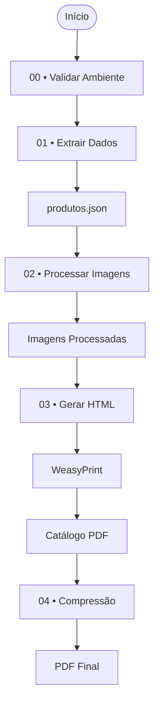

# Casa Sinelli — Catálogo

Pipeline de automação desenvolvido em Python para transformar o inventário de produtos da Casa Sinelli em um catálogo profissional em PDF, utilizando processamento de imagens, templates HTML/Jinja2 e geração automatizada de documentos.


# Objetivos

Este projeto automatiza a geração do catálogo institucional da Casa Sinelli, substituindo um processo manual de edição de PDFs por um pipeline reproduzível baseado em Python.

Como resultado, o processo de atualização do catálogo torna-se mais rápido, consistente e menos suscetível a erros operacionais.

# Diferenciais

- Pipeline modular em cinco etapas independentes
- Fonte única de verdade baseada em JSON
- Separação entre dados, apresentação e processamento
- Geração automatizada de PDFs para impressão e WhatsApp
- Templates HTML reutilizáveis com Jinja2
- Processamento automatizado de imagens

# Funcionalidades

- Extração das informações dos produtos
- Organização automática dos dados em JSON
- Processamento e normalização das imagens
- Geração do HTML do catálogo
- Conversão do HTML para PDF
- Compressão do PDF final
- Organização dos produtos por categorias
- Pipeline executado em etapas independentes

## Fluxo de Processamento

```text
Inventário de Produtos
           │
           ▼
Extração dos Dados
           │
           ▼
Produtos JSON
           │
           ▼
Processamento das Imagens
           │
           ▼
Template HTML + CSS
           │
           ▼
Geração do PDF
           │
           ▼
Compressão
           │
           ▼
Catálogo Final
```

## Stack Tecnológica

| Tecnologia | Utilização |
|------------|------------|
| Python | Pipeline de automação |
| Jinja2 | Renderização do template HTML |
| WeasyPrint | Conversão HTML → PDF |
| Pillow | Manipulação de imagens |
| HTML | Estrutura do catálogo |
| CSS | Layout de impressão |
| ImageMagick | Processamento externo de imagens |
| Ghostscript | Compressão do PDF |
| Poppler | Utilitários para PDF |

# Arquitetura

O projeto segue uma arquitetura baseada em **pipeline**, onde cada etapa possui uma responsabilidade única e pode ser executada de forma independente.

Essa separação reduz o acoplamento entre os processos, facilita a manutenção do código e permite reprocessar apenas a etapa necessária sem executar todo o fluxo novamente.

O processamento é dividido em cinco etapas principais:

1. Validação do ambiente
2. Extração dos dados
3. Processamento das imagens
4. Geração do catálogo
5. Compressão do PDF final

## Arquitetura da Solução


# Pipeline

O pipeline foi projetado para automatizar completamente a geração do catálogo, desde a organização das informações até a produção do PDF final.

Cada script possui uma responsabilidade específica, permitindo reexecução individual sempre que necessário.

| Etapa | Responsabilidade |
|--------|------------------|
| 00 | Verifica se todas as dependências e ferramentas externas estão instaladas |
| 01 | Extrai e organiza os dados dos produtos |
| 02 | Processa e normaliza todas as imagens |
| 03 | Renderiza o template HTML e gera o PDF |
| 04 | Comprime o PDF para compartilhamento |

## Fluxo do Pipeline



# Fonte dos Dados

Os produtos são centralizados em um arquivo JSON, utilizado como fonte única de verdade para geração do catálogo.

Essa abordagem desacopla os dados da camada de apresentação, permitindo que alterações no conteúdo não exijam modificações no template HTML.

```text
Inventário
      │
      ▼
Extração
      │
      ▼
produtos.json
      │
      ▼
Template HTML
      │
      ▼
PDF
```

# Processamento das Imagens

Antes da geração do catálogo, todas as imagens passam por uma etapa de normalização.

Esse processamento garante padronização visual entre produtos de diferentes fornecedores e reduz inconsistências durante a composição das páginas.

Entre as etapas do pipeline estão:

- Organização automática por categoria
- Padronização das imagens
- Preparação para impressão
- Disponibilização para renderização do template

# Geração do Catálogo

Após o processamento dos dados e das imagens, o template HTML é renderizado utilizando **Jinja2**.

O documento HTML gerado é convertido em PDF através do **WeasyPrint**, preservando o layout definido em CSS para impressão.

Ao final do processo, o PDF passa por uma etapa de compressão utilizando **Ghostscript**, produzindo uma versão otimizada para compartilhamento digital.


# Princípios da Arquitetura

- Responsabilidade única
- Pipeline modular
- Separação entre dados e apresentação
- Scripts independentes

# Boas Práticas Utilizadas

- Separação entre dados e apresentação
- Pipeline modular
- Scripts independentes
- Organização por responsabilidades
- Estrutura de diretórios padronizada
- Templates reutilizáveis
- Fonte única de dados em JSON
- Layout separado em CSS
- Organização das imagens por categoria
- Geração automatizada do documento final

# Performance

A arquitetura do pipeline foi projetada para minimizar etapas manuais e permitir o reprocessamento independente de cada fase, reduzindo o tempo necessário para atualização do catálogo.

### Otimizações implementadas

- Pipeline dividido em etapas independentes
- Fonte única de dados em JSON
- Processamento automatizado de imagens
- Templates reutilizáveis
- CSS específico para impressão
- Organização das imagens por categoria
- Compressão do PDF para distribuição digital
- Separação entre dados, apresentação e processamento

# Estrutura do Projeto

```text
.
├── RV/
│   └── Imagens originais do inventário
│
└── _catalogo/
    ├── assets/
    ├── css/
    ├── dados/
    ├── imagens_processadas/
    ├── output/
    ├── scripts/
    └── templates/
```

# Como executar

## Pré-requisitos

Antes de executar o projeto, verifique se o ambiente possui as dependências necessárias instaladas.

Entre elas estão:

- Python 3
- ImageMagick
- Ghostscript
- Poppler

## Clone o repositório

```bash
git clone https://github.com/Raphael-Sinelli/casa-sinelli-catalogo

cd casa-sinelli-catalogo
```

## Instale as dependências

```bash
pip install -r requirements.txt
```

## Execute o pipeline

Os scripts devem ser executados na ordem numérica.

```bash
python _catalogo/scripts/00_validar_ambiente.py

python _catalogo/scripts/01_extrair_dados.py

python _catalogo/scripts/02_processar_imagens.py

python _catalogo/scripts/03_gerar_catalogo.py

python _catalogo/scripts/04_comprimir_whatsapp.py
```

# Scripts

| Script | Descrição |
|---------|-----------|
| `00_validar_ambiente.py` | Verifica dependências e ferramentas instaladas |
| `01_extrair_dados.py` | Organiza os dados do inventário em JSON |
| `02_processar_imagens.py` | Normaliza e organiza as imagens |
| `03_gerar_catalogo.py` | Renderiza o template HTML e gera o PDF |
| `04_comprimir_whatsapp.py` | Gera uma versão otimizada para compartilhamento |

# Aprendizados

Durante o desenvolvimento deste projeto foram aprofundados conhecimentos em:

- Automação de processos utilizando Python
- Organização de pipelines
- Processamento de imagens
- Manipulação de arquivos
- Renderização de templates com Jinja2
- Geração automatizada de documentos PDF
- Estruturação de projetos voltados para automação

# Possíveis Evoluções

O projeto foi desenvolvido para atender às necessidades atuais da geração do catálogo, porém sua arquitetura permite futuras expansões, como:

- Interface gráfica para execução do pipeline
- Integração com banco de dados
- Publicação automática do catálogo
- Geração de múltiplos formatos de saída

# Documentação

A documentação principal encontra-se neste repositório.

Arquivos relevantes:

- `README.md`
- `requirements.txt`
- `_catalogo/templates/`
- `_catalogo/scripts/`
- `_catalogo/css/`

# Licença

Este projeto é disponibilizado apenas para fins de demonstração de portfólio.
Todos os direitos são reservados.

## Status

🟢 **Em uso**

Este pipeline é utilizado na geração do catálogo institucional da Casa Sinelli, produzindo automaticamente versões para impressão e distribuição digital.

# Autor

**Raphael Sinelli**

Tecnólogo em Análise e Desenvolvimento de Sistemas — FIAP

Desenvolvedor Full Stack | Python | React | TypeScript

- GitHub: https://github.com/Raphael-Sinelli
- LinkedIn: *(adicione seu perfil)*
- Website: https://www.casasinelli.com.br
